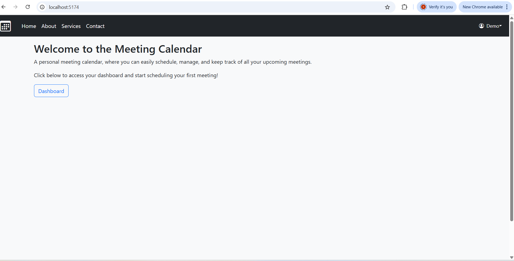
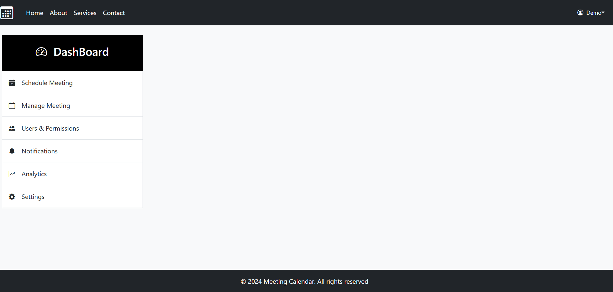
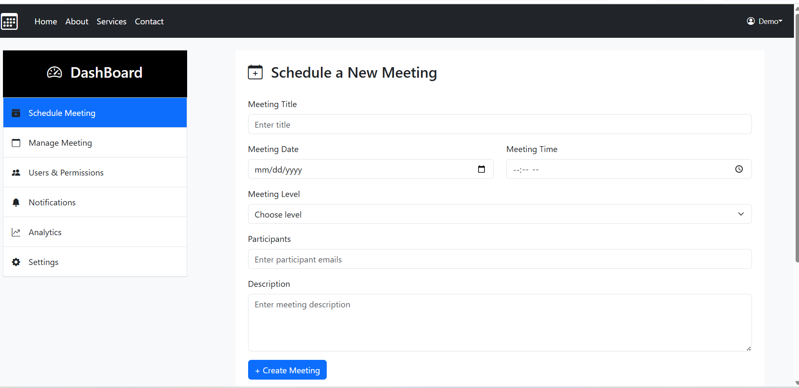
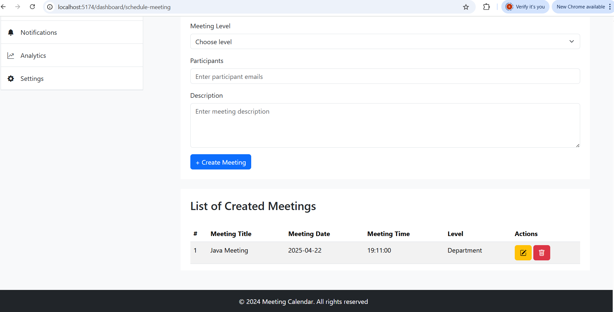
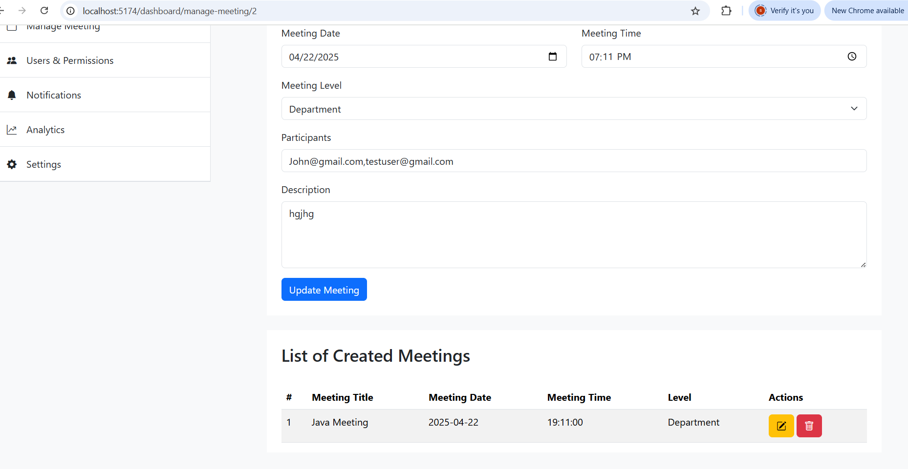
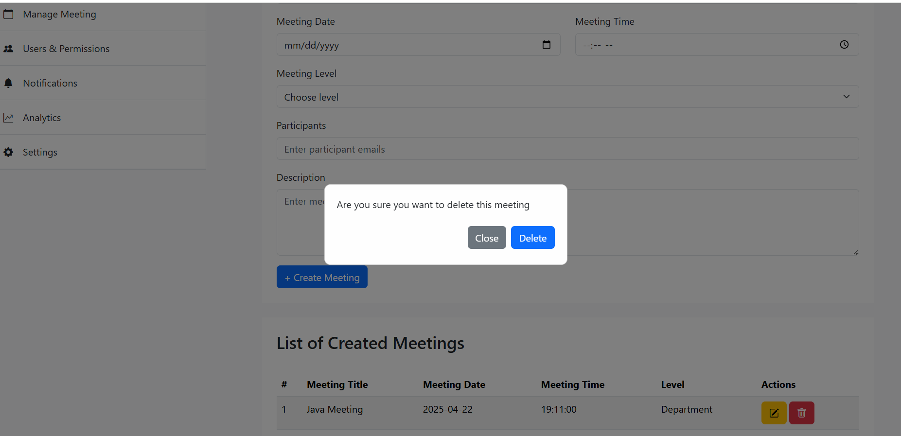

# 🗓️ Meeting Calendar -Frontend

 A meeting calendar application built using React, allows users to  schedule, manage, update and delete meetings.

 ## Table of Contents

1. [Overview](#overview)
2. [Features](#features)
    -- [Implemented Features](#implemented-features)
3. [Technologies Used](#technologies-used)
4. [Set up](#set-up)
5. [Project Structure](#project-structure)
6. [Working of the Project](#working-of-the-project)
7. [Screenshots](#screenshots)
8. [Future Enhancements](#future-enhancements)


## Overview

The **Meeting Calendar App** enables users to manage their schedules effectively. It provides a simple interface for adding, editing, and deleting meetings. The application is designed to support more features in future.


## Features

### Implemented Features

- **Create Meetings**: Create meetings with title, description, date and time and participants emails.
- **Edit Meetings**: Update details of existing meetings.
- **Delete Meetings**: Remove meetings from calendar.
- **Meeting List View**: View all scheduled meetings in a tabular format with  edit and delete button.


## Technologies Used

This project uses the following core technologies and libraries:

- **React**: A JavaScript library for building user interfaces.
- **Vite**: A next-generation, fast build tool for React applications.
- **Bootstrap**: A front-end framework for responsive, mobile-first web design.
- **Axios**: A promise-based HTTP client for making requests to the backend API.
- **React Router**: A library for handling navigation and routing in React applications.
- **React Hook Form**: A form management library for handling form validations and submissions in React.
- **React Modal**: A simple modal component for displaying dialogs and pop-ups.
- **@Popper.js/core**: a library to help you position tooltips, popovers, dropdowns and any contextual element that should appear near a button or similar.


## Set up

Follow the steps to run locally .

1. **Clone the repository**:
   - Run `git clone https://github.com/SayanaSurendra/meetingcalendar-react.git` to clone the project 
   - Then, navigate into the project directory using `cd meetingcalendar-react`.

2. **Install dependencies**:
   This project is built using Vite with React. To install the required dependencies
   - Use `npm install` to install all dependencies . This will include all the packages required for the app to function properly.

3. **Install additional dependencies**:
   - Run `npm install bootstrap@5 @popperjs/core axios react-hook-form react-modal react-router//////?????????` to install essential libraries like **Bootstrap**, **Axios**, **React Hook Form**, **React Router** and **React Modal**.

4. **Import Bootstrap CSS**:
   - In  `src/main.jsx` file, import Bootstrap’s CSS globally using:
     ```
     import "bootstrap/dist/css/bootstrap.css";
     import "bootstrap/dist/js/bootstrap.js";
     ```

5. **Start the development server**:
   - Finally, run `npm run dev` to start the app in development mode. 


## Project Structure

Project structure is as below.

```
meetingcalendar-react/
  README.md
  node_modules/
  public/
  src/
     assets/
     components/
     navpages/
     App.jsx
     index.css
     main.jsx
  .gitignore
  eslint.config.js
  index.html
  package-lock.json
  package.json
  vite.config.js


```

- **`public/`**: This directory contains images or favicons. 

- **`src/`**: This is the core of the application, where all the React components and logic are stored:
  - **`assets/`**: Contains images or other static resources used within the application.
  - **`components/`**: Contains reusable components such as the Sidebar, Form,Dashboard etc.
  - **`navpages/`**: Contains React components for different pages in the app, like the **Home**, **About**, **Services** and others.
  - **`App.js`**: The root React component that is rendered in the `main.jsx` file. It sets up routing and includes all components.
  - **`main.jsx`**: The entry point of your React application, where the React app is hooked into the DOM.
  - **`index.css`**: CSS file for  styling the application.

- **`.gitignore`**: Specifies files and folders that should not be tracked by Git.

- **`package.json`**: Contains metadata about the project (name, version) and lists the project dependencies and other settings.

- **`package-lock.json`**: Automatically generated file that locks the dependencies to specific versions to ensure consistency across different environments.

- **`vite.config.js`**: This is the configuration file for Vite, which is the build tool used for the React app. It can be customized to used custom port for development server.


## Working of the Project

The **Meeting Calendar App** allows users to schedule, manage, and view meetings in an organized way. Here's how the application works:

1. **Home**: 
   - When the application is launched, users land on the Home page which has a button to navigate to dashboard.
   
2. **Dashboard**:
   - The dashboard displays a sidebar for navigation to ScheduleMeeting, Manage Meeting ,Notifications and others.
   
3. **Schedule Meeting**:
   - Users can create new meetings by filling in details like title, date, time,meeting description,participants emails and meeting level.
   - Form validation is handled using **React Hook Form**.
   - Also displays a list of all scheduled meetings with **edit** and **delete** options.

3. **Edit Meeting** & **Delete Meeting**:
   
   - Each meeting entry provides options to **edit** or **delete**.  
   - Users can edit existing meetings by clicking the **Edit** button, which pre-fills the form with the current meeting details.  
   - The application uses `useParams` from **React Router** to extract the `meetingId` from the URL and load the relevant meeting data.  
   - On Delete, a pop up is displayed asking for confirmation to delete the meeting

4. **Routing**:
   - The application  uses **React Router** to handle navigation between different pages such as Scheduling, Managing, Settings, Notifications, etc.

5. **State Management**:
   - React’s built-in state hooks (`useState`, `useEffect`) manage data flow.
   - Axios is used to fetch, submit ,update and delete meeting data via API calls.

6. **Notifications, Manage Meetings, Settings, and User Permissions**:
   - These sections are structured for future implementation and are accessible from the sidebar.


## Screenshots

Below are some screenshots for **Meeting Calendar**:

### Home Page


### Sidebar Navigation


### Schedule Meeting


### Display Meeting


### Edit Meeting


### Delete Meeting



## Future Enhancements
Below are few features planned for future development to enhance the functionality and user experience:

- **User Authentication & Login**  
  Implement secure user login for personalize access.

-  **User Profile Management**  
  Allow users to view and update their profile information, including name, availability and preferences.

- **Role-Based Access**  
  Define user roles such as Admin, guests and users with different levels of permissions and access to features.

- **Analytics Dashboard**  
  Display insights like total meetings scheduled, frequent time slots and user activity trends.

- **Settings**  
  Let users configure preferences such as time zone, default meeting duration.

- **Notifications**  
  Notify users of upcoming meetings, changes and reminders via email and UI alerts.


